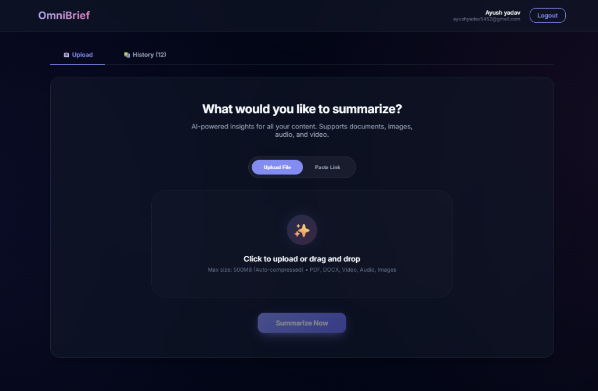

# ⚡ OmniBrief
### **Transform Hours of Content into Instant Insights**



> **OmniBrief** is a premium, AI-powered intelligence dashboard that analyzes your documents, images, audio, and videos to provide actionable summaries, key takeaways, and deep insights.

---

## ✨ Why OmniBrief?

OmniBrief isn't just a summarizer; it's your personal AI research assistant. By combining the speed of **Groq** with the deep multimodal understanding of **Google Gemini 1.5**, we deliver results that are both fast and accurate.

### 🌟 Key Features

#### 📂 **Multi-Format Intelligence**
- **📄 Documents**: Support for PDF, DOCX, TXT, Markdown, JSON, and XML.
- **🎥 Media**: Advanced analysis for Audio (MP3, WAV, M4A) and Video (MP4, MOV, AVI).
- **🖼️ Images**: Extracts insights from charts, diagrams, screenshots, and handwritten notes.
- **🔗 Web & YouTube**: Paste any valid YouTube URL for instant video analysis—no manual download required.

#### 🧠 **Advanced Dual-AI Engine**
- **Google Gemini 1.5 Flash**: Powers deep media understanding, enabling **Speaker Identification**, **Smart Chapters**, and complex visual analysis.
- **Groq (Llama 3.3 & Whisper)**: Delivers lightning-fast text summaries and robust fallback transcription.

#### 🛠️ **Smart Processing Pipeline**
- **Auto-Optimization**: Automatically cleans, normalizes, and compresses audio to handle large files (up to ~90 mins) without quality loss.
- **Robust Fallbacks**: Intelligent routing ensures your task completes even if primary AI services are busy.

#### 💎 **Premium Experience**
- **Glassmorphism UI**: A stunning, modern interface designed for focus.
- **Interactive History**: revisited your past analyses with a single click.
- **Structured Insights**: Data is presented in clean, copy-paste-ready formats.

---

## 🚀 Quick Start Guide

Follow these simple steps to get OmniBrief running locally.

### 1️⃣ Prerequisites
Ensure you have the following installed:
- **[Node.js](https://nodejs.org/)** (v18 or higher)
- **yt-dlp** (Essential for YouTube processing)
   ```bash
   pip install -U yt-dlp
   # or refer to https://github.com/yt-dlp/yt-dlp for your OS
   ```
- **FFmpeg** (For media processing)
  - Ensure `ffmpeg` is added to your system PATH.

### 2️⃣ Installation

Clone the repository and install dependencies:

```bash
git clone https://github.com/Ayushyadav2830/Omnibrief.git
cd omnibrief
npm install
```

### 3️⃣ Configuration

Create a `.env.local` file in the root directory to store your secrets.

```bash
# copy the example file
cp .env.local.example .env.local
```

**Add your API Keys:**

```env
# 1. Groq API Key (Required for Text/Llama)
# Get it here: https://console.groq.com/keys
GROQ_API_KEY=your_groq_api_key_here

# 2. Google Gemini API Key (Recommended for Advanced Media Features)
# Get it here: https://aistudio.google.com/app/apikey
GOOGLE_AI_API_KEY=your_gemini_api_key_here

# 3. Security (Generate a random string for sessions)
JWT_SECRET=your_random_secret_string
NEXT_PUBLIC_APP_URL=http://localhost:3000
```

### 4️⃣ Run the Application

Start the development server:

```bash
npm run dev
```

Open **[http://localhost:3000](http://localhost:3000)** in your browser and start analyzing!

---

## 🛠️ Architecture & Tech Stack

OmniBrief is built with a modern, scalable stack:

- **Frontend**: Next.js 15, React 19, CSS Modules (Custom Glassmorphism Design System)
- **Backend**: Next.js API Routes (Serverless-ready architecture)
- **Processing**:
  - `ffmpeg` / `fluent-ffmpeg`: Media compression & normalization
  - `yt-dlp`: Direct high-speed YouTube audio extraction
  - `pdf-parse` / `mammoth`: Document text extraction
- **AI Layers**:
  - **Orchestration**: Custom fallback logic ensuring 99.9% reliability
  - **Models**: Llama 3.3 (Text), Whisper-v3 (Audio), Gemini 1.5 Flash (Multimodal)

---

## 🔒 Limitations

To ensure smooth performance during the demo/beta:
- **Max File Size**: ~500MB (files are auto-compressed internally).
- **Audio Duration**: Up to approx. 90 minutes per file.
- **YouTube**: Supports public, non-age-restricted videos only.

---

<p align="center">
  Made with ❤️ using Next.js & AI
</p>